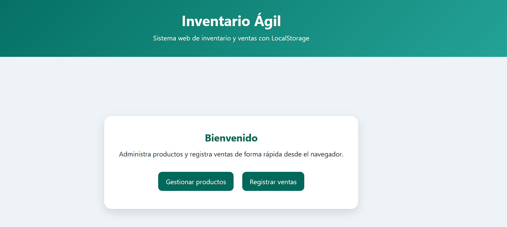
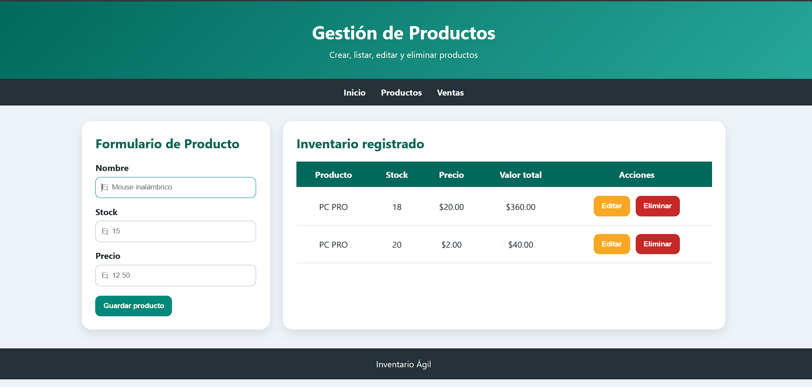
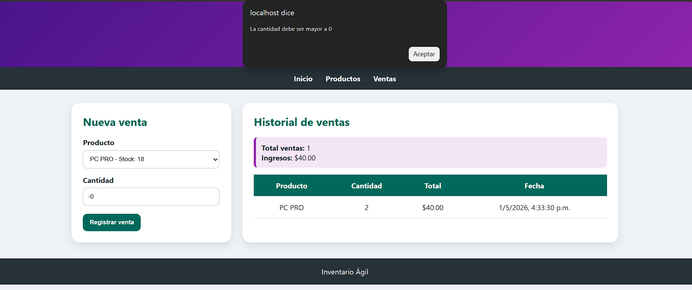

# Inventario Ágil

Sistema web desarrollado en PHP y JavaScript que permite gestionar productos y registrar ventas utilizando LocalStorage como método de persistencia de datos.

---

## Descripción del sistema

Inventario Ágil es una aplicación web que simula un sistema de inventario y ventas. Permite administrar productos y registrar ventas en tiempo real desde el navegador, sin necesidad de base de datos.

El sistema implementa una arquitectura basada en capas (Models, Controllers, Services) y utiliza PHP para validaciones del lado del servidor, mientras que JavaScript gestiona la interacción y almacenamiento en LocalStorage.

---

## Tecnologías utilizadas

* PHP (estructura MVC básica)
* JavaScript (ES6)
* LocalStorage (persistencia de datos)
* HTML5
* CSS3
* Fetch API

---

## Funcionalidades principales

### Módulo de Productos (CRUD)

* Crear productos
* Listar productos
* Editar productos
* Eliminar productos

### Módulo de Ventas

* Seleccionar producto
* Registrar venta
* Descontar stock automáticamente
* Historial de ventas
* Cálculo de ingresos

---

## Validaciones implementadas

### Productos

* Nombre no vacío
* Stock mayor o igual a 0
* Precio mayor a 0
* No se permite stock negativo

### Ventas

* Cantidad mayor a 0
* No se puede vender más del stock disponible

---

## Arquitectura del sistema

El proyecto está organizado en capas:

models/ → Representación de datos
controllers/ → Validaciones y lógica básica
services/ → Reglas de negocio
public/ → Interfaz y ejecución

Además:

* PHP se utiliza para validaciones tipo API
* JavaScript gestiona la lógica dinámica
* LocalStorage se utiliza como persistencia

---

## Estructura del proyecto

## Estructura del proyecto

```
inventario-ventas/
│
├── models/
│   ├── Producto.php
│   └── Venta.php
│
├── controllers/
│   ├── ProductoController.php
│   └── VentaController.php
│
├── services/
│   └── VentaService.php
│
├── public/
│   ├── index.php
│   ├── productos.php
│   ├── ventas.php
│
│   ├── css/
│   │   └── styles.css
│
│   ├── js/
│   │   ├── productos.js
│   │   └── ventas.js
│
│   └── api/
│       ├── validar_producto.php
│       └── validar_venta.php
│
├── img/
│   ├── captura1.png
│   ├── captura2.png
│   └── captura3.png
│
└── README.md
```


---

## Instalación y ejecución

### Opción 1: Clonar el repositorio

1. Abrir la terminal o Git Bash
2. Ubicarse en la carpeta de XAMPP:

cd C:\xampp\htdocs

3. Clonar el repositorio:

git clone https://github.com/javalencia-dotcom/Inventario-ventas.git

---

### Opción 2: Descargar como ZIP

1. Ir al repositorio en GitHub:
   https://github.com/javalencia-dotcom/Inventario-ventas

2. Clic en el botón Code

3. Seleccionar Download ZIP

4. Extraer el archivo en:

C:\xampp\htdocs\

---

### Ubicación del proyecto

El proyecto debe quedar en:

C:\xampp\htdocs\Inventario-ventas\Proyecto_integrador_final\

---
## Nota sobre descarga del repositorio

Al descargar el proyecto desde GitHub en formato ZIP, el archivo se obtiene con un nombre que incluye el sufijo `-main`, por ejemplo:

Inventario-ventas-main

Este nombre es generado automáticamente por GitHub y no representa un error en el proyecto.

Sin embargo, se recomienda renombrar la carpeta a:

inventario-ventas

Esto facilita el uso de rutas en el navegador y evita posibles inconvenientes al momento de ejecutar el sistema en un entorno local.

Ejemplo:

Ruta original:
C:\xampp\htdocs\Inventario-ventas-main\

Ruta recomendada:
C:\xampp\htdocs\inventario-ventas\

En caso de no renombrar la carpeta, se debe ajustar la URL de acceso en el navegador:

http://localhost/Inventario-ventas-main/Proyecto_integrador_final/public/index.php

### Ejecución del sistema

1. Abrir XAMPP
2. Iniciar el servicio Apache
3. Acceder en el navegador:

http://localhost/Inventario-ventas/Proyecto_integrador_final/public/index.php

---

### Verificación

* Crear un producto
* Editar o eliminar productos
* Registrar una venta
* Verificar reducción de stock
* Revisar historial

---

### Recomendaciones

* No abrir el proyecto como archivo local (file:///)
* Usar localhost para ejecutar PHP
* Presionar Ctrl + F5 si no carga CSS o JS
* Verificar existencia de:

public/api/validar_producto.php
public/api/validar_venta.php

---

## Capturas del sistema

Página principal


Gestión de productos


Registro de ventas


---

## Usuario de prueba

No aplica. El sistema no requiere autenticación.

---

## Consideraciones

* Los datos se almacenan en LocalStorage
* Cada navegador mantiene su propia información
* No se requiere base de datos

---

## Conclusión

El sistema cumple con la implementación de un CRUD funcional, separación por capas y validaciones en cliente y servidor, utilizando tecnologías básicas de desarrollo web.

---

## Autor

Proyecto académico desarrollado para fines educativos.

